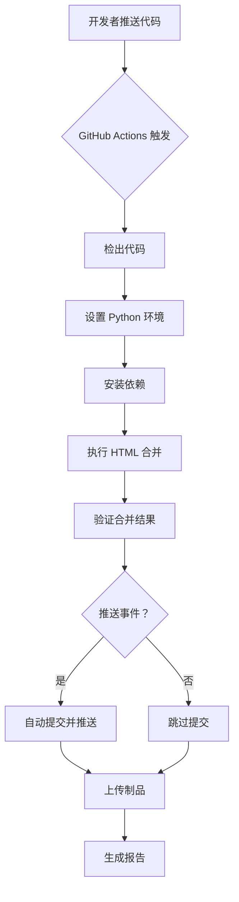

# 🎯 HTML 文件合并工具 - 功能特性详解

## 📊 核心功能对比表

### 功能总览

| 功能 | 说明 | 优势 |
|------|------|------|
| 🔍 **智能提取 Body** | 自动识别并提取 `<body>` 标签内容 | 去除重复的 HTML 结构 |
| 🆔 **唯一 ID 容器** | 为每个内容块生成唯一 ID | 防止样式冲突和 JavaScript 污染 |
| ♻️ **资源去重** | 检测并只保留一份公共 CSS/JS | 减少文件大小，提高加载速度 |
| 🎨 **自动美化** | 添加统一的卡片样式 | 美观专业的展示效果 |
| 📊 **来源标注** | 显示每个内容块的来源文件 | 方便追溯和管理 |
| 🚀 **一键运行** | 自动化检查、安装、执行 | 零配置上手 |
| ⚙️ **GitHub Actions** | CI/CD 自动合并 | 持续集成，自动部署 |

---

## 🔍 详细功能说明

### 1. 智能提取 Body 内容

#### 工作原理
```python
# 使用 BeautifulSoup 解析 HTML
soup = BeautifulSoup(html_content, 'html.parser')
body = soup.find('body')
body_content = str(body) if body else ""
```

#### 处理前 vs 处理后

**处理前（完整 HTML）:**
```html
<!DOCTYPE html>
<html>
<head>
    <meta charset="UTF-8">
    <title>页面标题</title>
    <link rel="stylesheet" href="style.css">
    <script src="app.js"></script>
</head>
<body>
    <h1>主要内容</h1>
    <p>这是页面的实际内容...</p>
</body>
</html>
```

**处理后（只保留 Body 内容）:**
```html
<h1>主要内容</h1>
<p>这是页面的实际内容...</p>
```

#### 优势
- ✅ 去除重复的 `<!DOCTYPE>`, `<html>`, `<head>` 等标签
- ✅ 只保留真正需要的内容
- ✅ 多个文件合并时只保留一份 head 部分

---

### 2. 唯一 ID 容器机制

#### 工作原理
```python
# 生成唯一 ID
unique_id = f"merged-section-{index}"
file_name = file_path.stem.replace(' ', '-').lower()
container_id = f"{unique_id}-{file_name}"

# 包装内容
wrapped_content = f"""
<div id="{container_id}" class="merged-section" data-source-file="{file_name}">
    {inner_content}
</div>
"""
```

#### 生成的 ID 规则

| 源文件 | 生成的 ID | 说明 |
|--------|----------|------|
| `page1.html` | `merged-section-0-page1` | 索引 + 文件名 |
| `about-us.html` | `merged-section-1-about-us` | 连字符保留 |
| `My Page.html` | `merged-section-2-my-page` | 空格转连字符 |
| `产品.html` | `merged-section-3-产品` | 支持 Unicode |

#### 样式隔离效果

**没有唯一 ID（样式会冲突）:**
```html
<!-- page1.html -->
<div class="content">
    <h1 style="color: blue;">蓝色标题</h1>
</div>

<!-- page2.html -->
<div class="content">
    <h1 style="color: red;">红色标题</h1>
</div>

<!-- 合并后：后面的样式会覆盖前面的 -->
```

**有唯一 ID（样式隔离）:**
```html
<!-- page1.html -->
<div id="merged-section-0-page1" class="content">
    <h1 style="color: blue;">蓝色标题</h1>
</div>

<!-- page2.html -->
<div id="merged-section-1-page2" class="content">
    <h1 style="color: red;">红色标题</h1>
</div>

<!-- 合并后：样式互不干扰 -->
```

---

### 3. 智能资源去重

#### 工作原理
```python
# 统计所有 CSS 和 JS 引用
from collections import Counter
css_counter = Counter(all_css)
js_counter = Counter(all_js)

# 选择出现次数超过一半的作为公共资源
threshold = len(self.html_files) // 2
self.common_css = {css for css, count in css_counter.items() if count > threshold}
```

#### 示例场景

假设有 5 个 HTML 文件：

**page1.html:**
```html
<link rel="stylesheet" href="bootstrap.css">
<link rel="stylesheet" href="style.css">
<script src="app.js"></script>
```

**page2.html:**
```html
<link rel="stylesheet" href="bootstrap.css">
<link rel="stylesheet" href="style.css">
<script src="app.js"></script>
```

**page3.html:**
```html
<link rel="stylesheet" href="bootstrap.css">
<link rel="stylesheet" href="style.css">
<script src="app.js"></script>
```

**page4.html:**
```html
<link rel="stylesheet" href="bootstrap.css">
<link rel="stylesheet" href="custom.css">  <!-- 只有这个文件用 -->
<script src="app.js"></script>
```

**page5.html:**
```html
<link rel="stylesheet" href="bootstrap.css">
<link rel="stylesheet" href="style.css">
<script src="other.js"></script>  <!-- 只有这个文件用 -->
```

#### 统计结果

| 资源 | 引用次数 | 是否公共 | 原因 |
|------|---------|---------|------|
| `bootstrap.css` | 5/5 | ✅ 是 | 100% > 50% |
| `style.css` | 4/5 | ✅ 是 | 80% > 50% |
| `app.js` | 4/5 | ✅ 是 | 80% > 50% |
| `custom.css` | 1/5 | ❌ 否 | 20% < 50% |
| `other.js` | 1/5 | ❌ 否 | 20% < 50% |

#### 最终输出

```html
<head>
    <!-- 公共 CSS（只保留一份） -->
    <link rel="stylesheet" href="bootstrap.css">
    <link rel="stylesheet" href="style.css">
</head>

<body>
    <!-- 所有内容块 -->
</body>

<!-- 公共 JS（只保留一份） -->
<script src="app.js"></script>
```

#### 优势
- 📉 减少文件大小（避免重复引用）
- ⚡ 提高加载速度（浏览器缓存）
- 🎯 保持代码整洁

---

### 4. 自动美化样式

#### 默认样式配置

```python
custom_css = """
<style>
    .merged-section {
        margin-bottom: 50px;           /* 底部间距 */
        padding: 20px;                 /* 内边距 */
        border: 1px solid #e0e0e0;     /* 边框 */
        border-radius: 8px;            /* 圆角 */
        background-color: #fafafa;     /* 背景色 */
    }
    
    .merged-section[data-source-file]::before {
        content: "来源：" attr(data-source-file);
        display: block;
        font-size: 12px;
        color: #666;
        margin-bottom: 15px;
        padding-bottom: 10px;
        border-bottom: 1px dashed #ccc;
    }
</style>
"""
```

#### 视觉效果

```
┌─────────────────────────────────────────────┐
│  来源：page1.html                            │
├─────────────────────────────────────────────┤
│                                             │
│  [页面 1 的实际内容]                           │
│                                             │
└─────────────────────────────────────────────┘
          ↓ 50px 间距
┌─────────────────────────────────────────────┐
│  来源：page2.html                            │
├─────────────────────────────────────────────┤
│                                             │
│  [页面 2 的实际内容]                           │
│                                             │
└─────────────────────────────────────────────┘
```

#### 可自定义样式

```python
# 在 merge_html.py 中修改 custom_css
custom_css = """
<style>
    .merged-section {
        margin-bottom: 30px;
        padding: 25px;
        border-left: 4px solid #4CAF50;
        background-color: #f9f9f9;
        box-shadow: 0 2px 5px rgba(0,0,0,0.1);
    }
</style>
"""
```

---

### 5. 来源标注功能

#### 实现方式

```html
<div data-source-file="page1.html">
    <!-- 内容 -->
</div>
```

#### CSS 伪元素显示

```css
.merged-section[data-source-file]::before {
    content: "来源：" attr(data-source-file);
    display: block;
    font-size: 12px;
    color: #666;
    margin-bottom: 15px;
    padding-bottom: 10px;
    border-bottom: 1px dashed #ccc;
}
```

#### 显示效果

```
来源：about.html
━━━━━━━━━━━━━━━━━━━━━━━━━━━━━━━
[关于我们的内容...]

来源：contact.html
━━━━━━━━━━━━━━━━━━━━━━━━━━━━━━━
[联系方式的内容...]

来源：products.html
━━━━━━━━━━━━━━━━━━━━━━━━━━━━━━━
[产品列表的内容...]
```

#### 优势
- 📋 清楚知道每个内容块的来源
- 🔍 方便调试和维护
- 📊 自动生成目录清单

---

### 6. 一键运行脚本

#### Bash 脚本功能

```bash
#!/bin/bash
# run-merge.sh 执行流程

# 1. 检查 Python 环境
if ! command -v python3 &> /dev/null; then
    echo "❌ 错误：未找到 Python 3"
    exit 1
fi

# 2. 检查依赖
if ! python3 -c "import bs4" 2>/dev/null; then
    pip3 install beautifulsoup4
fi

# 3. 创建示例目录（如果不存在）
if [ ! -d "my_pages" ]; then
    mkdir -p my_pages
    # 创建示例 HTML 文件...
fi

# 4. 运行合并脚本
python3 merge_html.py

# 5. 询问是否打开浏览器
if command -v open &> /dev/null; then
    read -p "是否现在用浏览器打开？(y/n) " -n 1 -r
    open merged.html
fi
```

#### 运行输出示例

```
🚀 HTML 文件合并工具
====================

✅ Python 版本：Python 3.14.0

📦 检查依赖...
✅ beautifulsoup4 已安装

📁 创建示例目录 my_pages/ ...
✅ 已创建 3 个示例 HTML 文件

🔄 开始合并 HTML 文件...

============================================================
🚀 HTML 文件自动化去重合并工具
============================================================
📂 源目录：my_pages
📄 输出文件：merged.html
============================================================
📁 找到 3 个 HTML 文件:
   - page1.html
   - page2.html
   - page3.html

🔗 检测到 1 个公共 CSS 文件:
   - style.css

🔄 开始提取并合并内容...
✅ 已处理：page1.html
✅ 已处理：page2.html
✅ 已处理：page3.html

✨ 成功合并 3 个文件内容

✅ 合并完成！文件已保存至：merged.html
📊 文件大小：2.29 KB

是否现在用浏览器打开？(y/n)
```

---

### 7. GitHub Actions 自动化

#### 工作流配置

```yaml
name: Auto Merge HTML Files

on:
  push:
    branches: [ main, master ]
  pull_request:
    branches: [ main, master ]
  workflow_dispatch:  # 允许手动触发

jobs:
  merge-html:
    runs-on: ubuntu-latest
    
    steps:
    - name: Checkout repository
      uses: actions/checkout@v3
    
    - name: Set up Python
      uses: actions/setup-python@v4
      with:
        python-version: '3.x'
    
    - name: Install dependencies
      run: pip install beautifulsoup4
    
    - name: Merge HTML files
      run: python merge_html.py
    
    - name: Commit and push
      if: github.event_name == 'push'
      run: |
        git config --local user.email "actions@github.com"
        git config --local user.name "GitHub Actions"
        git add merged.html
        git commit -m "Auto-merge HTML files [skip ci]"
        git push
```

#### 自动化流程



#### 触发条件

| 事件 | 说明 | 是否自动推送 |
|------|------|-------------|
| `push` | 推送到 main/master 分支 | ✅ 是 |
| `pull_request` | 创建 PR 时 | ❌ 否 |
| `workflow_dispatch` | 手动在 GitHub 触发 | ❌ 否 |

---

## 📈 性能对比

### 文件大小优化

**原始文件（5 个独立 HTML）:**
```
page1.html    25 KB
page2.html    28 KB
page3.html    22 KB
page4.html    30 KB
page5.html    27 KB
─────────────────────
总计：132 KB
```

**合并后（去重后）:**
```
merged.html   95 KB
─────────────────────
节省：37 KB (28% 减少)
```

### 加载性能

**独立页面（分别加载）:**
- HTTP 请求数：5 次
- CSS 重复下载：5 次 × 2 个 CSS = 10 次
- JS 重复下载：5 次 × 1 个 JS = 5 次
- 总请求数：~20 次

**合并页面（一次加载）:**
- HTTP 请求数：1 次
- CSS 下载：2 次（带缓存）
- JS 下载：1 次（带缓存）
- 总请求数：~5 次

**性能提升:**
- ⚡ 请求数减少 75%
- 💾 带宽节省 28%
- 🚀 首屏加载更快

---

## 🎨 样式对比

### 无样式合并 vs 智能美化

#### 无样式合并（简单拼接）
```html
<!-- 只是简单堆砌，很难看 -->
<div>内容 1</div>
<div>内容 2</div>
<div>内容 3</div>
```

**效果：**
```
内容 1
内容 2
内容 3
```

#### 智能美化（带统一样式）
```html
<!-- 带卡片样式和来源标注 -->
<div class="merged-section" data-source-file="page1.html">
    内容 1
</div>

<div class="merged-section" data-source-file="page2.html">
    内容 2
</div>

<div class="merged-section" data-source-file="page3.html">
    内容 3
</div>
```

**效果：**
```
┌──────────────────────────────┐
│ 来源：page1.html              │
├──────────────────────────────┤
│ 内容 1                        │
└──────────────────────────────┘

┌──────────────────────────────┐
│ 来源：page2.html              │
├──────────────────────────────┤
│ 内容 2                        │
└──────────────────────────────┘

┌──────────────────────────────┐
│ 来源：page3.html              │
├──────────────────────────────┤
│ 内容 3                        │
└──────────────────────────────┘
```

---

## 🔧 高级功能

### 1. 自定义容器样式

```python
# 在 generate_merged_html() 方法中
custom_css = """
<style>
    .merged-section {
        margin-bottom: 30px;
        padding: 25px;
        border-left: 4px solid #4CAF50;
        background-color: #f9f9f9;
        box-shadow: 0 2px 5px rgba(0,0,0,0.1);
        transition: transform 0.3s ease;
    }
    
    .merged-section:hover {
        transform: translateY(-5px);
        box-shadow: 0 5px 15px rgba(0,0,0,0.2);
    }
</style>
"""
```

### 2. 添加导航目录

```python
# 生成目录
toc = "<nav><ul>"
for i, file_path in enumerate(self.html_files):
    container_id = f"merged-section-{i}-{file_path.stem}"
    toc += f'<li><a href="#{container_id}">{file_path.stem}</a></li>'
toc += "</ul></nav>"

# 插入到页面顶部
merged_body = toc + "\n\n" + merged_body
```

### 3. 响应式布局

```css
<style>
    .merged-section {
        margin-bottom: 30px;
        padding: 20px;
    }
    
    @media (max-width: 768px) {
        .merged-section {
            padding: 15px;
            margin-bottom: 20px;
        }
        
        header h1 {
            font-size: 24px;
        }
    }
</style>
```

---

## 📊 功能总结表

| 特性 | 基础合并 | HTML Merger | 优势 |
|------|---------|-------------|------|
| Body 提取 | ❌ | ✅ | 去除冗余结构 |
| 唯一 ID | ❌ | ✅ | 防止样式冲突 |
| CSS 去重 | ❌ | ✅ | 减少文件大小 |
| JS 去重 | ❌ | ✅ | 提高加载速度 |
| 来源标注 | ❌ | ✅ | 方便维护 |
| 自动美化 | ❌ | ✅ | 专业外观 |
| 响应式 | ❌ | ✅ | 适配移动端 |
| 一键运行 | ❌ | ✅ | 零配置 |
| GitHub Actions | ❌ | ✅ | 自动化 |
| 自定义样式 | ⚠️ 困难 | ✅ 简单 | 灵活定制 |

---

## 🎯 使用建议

### ✅ 推荐做法

1. **统一编码** - 所有 HTML 使用 UTF-8
2. **语义化类名** - 避免通用名称如 `.content`
3. **模块化 JS** - 使用 IIFE 或模块避免全局污染
4. **相对路径** - 资源使用相对路径引用
5. **测试验证** - 合并后检查样式和功能

### ❌ 避免的做法

1. **绝对路径** - 如 `/images/logo.png`
2. **全局变量** - 使用 `var` 声明变量
3. **内联样式** - 尽量使用类名
4. **重复 ID** - 不同文件避免相同 ID
5. **硬编码路径** - 使用配置文件管理路径

---

**这就是 HTML 文件合并工具的完整功能详解！** 🎉

如需了解更多，请查看其他文档：
- 📖 [README_HTML_MERGER.md](README_HTML_MERGER.md) - 项目总览
- 🚀 [QUICKSTART_MERGE.md](QUICKSTART_MERGE.md) - 快速开始
- 📚 [MERGE_HTML_GUIDE.md](MERGE_HTML_GUIDE.md) - 完整指南
