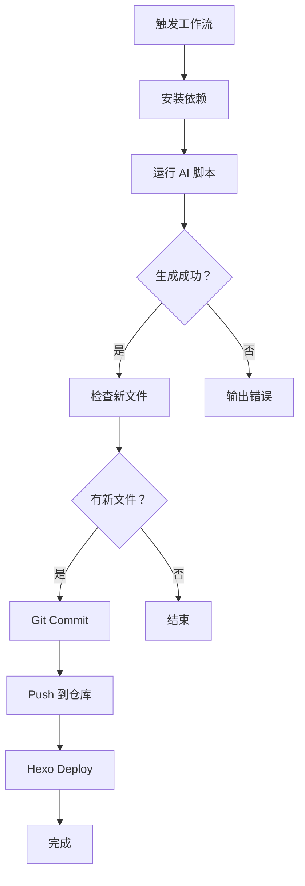

# AI 自动创作工具使用指南

强大的 AI 金融博客自动创作工具，支持多种 AI 模型和随机主题生成。

---

## 📋 目录

- [功能特性](#功能特性)
- [快速开始](#快速开始)
- [配置说明](#配置说明)
- [使用方式](#使用方式)
- [高级用法](#高级用法)
- [GitHub Actions 自动创作](#github-actions 自动创作)
- [常见问题](#常见问题)

---

## ✨ 功能特性

### 🎯 核心功能

- ✅ **多模型支持**: OpenAI GPT-4、通义千问、百度文心、深度求索等
- ✅ **随机主题池**: 8 大分类、64+ 专业主题，防止内容雷同
- ✅ **智能 Front-matter**: 自动生成标题、标签、分类
- ✅ **多种模板**: 基础版 (1200 字)、快速版 (600 字)、深度版 (2500 字)
- ✅ **批量生成**: 一次生成多篇文章
- ✅ **自动部署**: 集成 GitHub Actions，定时自动发布

### 📊 主题分类

| 分类 | 主题数量 | 示例 |
|------|---------|------|
| **宏观经济学** | 8 | 美联储利率决议、全球经济增速 |
| **市场分析** | 8 | A 股结构性机会、美股估值分析 |
| **投资策略** | 8 | 家庭资产配置、养老规划 |
| **ESG 投资** | 8 | 绿色金融、碳中和投资 |
| **金融科技** | 8 | AI 量化交易、区块链应用 |
| **加密货币** | 8 | 比特币周期、DeFi 风险评估 |
| **保险规划** | 8 | 医疗险配置、年金险对比 |
| **风险管理** | 8 | 黑天鹅应对、止损策略 |

---

## 🚀 快速开始

### 1. 安装依赖

```bash
# 安装 Python 依赖
pip install openai

# 或使用国内镜像
pip install openai -i https://pypi.tuna.tsinghua.edu.cn/simple
```

### 2. 配置 API Key

#### 方式 A: 环境变量（推荐）

```bash
# 临时设置（当前终端有效）
export AI_API_KEY='sk-your-api-key-here'
export AI_BASE_URL='https://api.openai.com/v1'

# 永久设置（添加到 ~/.zshrc 或 ~/.bashrc）
echo 'export AI_API_KEY="sk-xxx"' >> ~/.zshrc
echo 'export AI_BASE_URL="https://api.openai.com/v1"' >> ~/.zshrc
source ~/.zshrc
```

#### 方式 B: .env 文件

```bash
# 复制示例文件
cp scripts/.env.example scripts/.env

# 编辑 .env 文件，填入真实的 API Key
vim scripts/.env
```

### 3. 生成第一篇文章

```bash
# 方式 1: 使用 npm 脚本
npm run ai-write

# 方式 2: 直接运行 Python 脚本
python scripts/ai_writer.py

# 方式 3: 批量生成 3 篇
npm run ai-write-batch
```

---

## ⚙️ 配置说明

### API 配置

不同 AI 模型的配置示例：

#### OpenAI GPT-4

```bash
AI_API_KEY=sk-usxxxxxxxxxxxxxxxx
AI_BASE_URL=https://api.openai.com/v1
DEFAULT_MODEL=gpt-4o
```

#### 通义千问（阿里云）

```bash
AI_API_KEY=sk-xxxxxxxxxxxxxxxx
AI_BASE_URL=https://dashscope.aliyuncs.com/compatible-mode/v1
DEFAULT_MODEL=qwen-max
```

#### 百度文心一言

```bash
AI_API_KEY=xxxxxxxxxxxxxxxx
AI_BASE_URL=https://qianfan.baidubce.com/v2
DEFAULT_MODEL=ernie-4.0
```

#### 深度求索

```bash
AI_API_KEY=sk-xxxxxxxxxxxxxxxx
AI_BASE_URL=https://api.deepseek.com/v1
DEFAULT_MODEL=deepseek-chat
```

### 环境变量列表

| 变量名 | 必填 | 说明 | 默认值 |
|--------|------|------|--------|
| `AI_API_KEY` | ✅ | AI 模型 API 密钥 | 无 |
| `AI_BASE_URL` | ❌ | API 基础 URL | OpenAI 地址 |
| `DEFAULT_MODEL` | ❌ | 默认模型名称 | qwen-max |

---

## 💻 使用方式

### 基本命令

```bash
# 生成 1 篇（随机主题）
python scripts/ai_writer.py

# 生成 3 篇
python scripts/ai_writer.py --count 3

# 指定模型
python scripts/ai_writer.py --model gpt-4o

# 指定主题
python scripts/ai_writer.py --topic "A 股市场结构性机会"

# 指定分类
python scripts/ai_writer.py --category market

# 使用深度模板
python scripts/ai_writer.py --template deep
```

### 命令行参数详解

```bash
python scripts/ai_writer.py [选项]

选项:
  --model MODEL        AI 模型名称
                       可选：gpt-4o, qwen-max, ernie-4.0, deepseek-chat
                       默认：qwen-max
  
  --count N            生成文章数量
                       范围：1-10
                       默认：1
  
  --template TYPE      文章模板类型
                       可选：base (标准), quick (短评), deep (深度)
                       默认：base
  
  --topic TOPIC        指定具体主题
                       例："美联储利率决议对全球资本市场的影响"
  
  --category CAT       指定分类（随机该分类下的主题）
                       可选：macro, market, strategy, esg, 
                            tech, crypto, insurance, risk
  
  --list-topics        列出所有可用主题
  
  -h, --help          显示帮助信息
```

### 实战示例

#### 示例 1: 生成一篇宏观经济文章

```bash
python scripts/ai_writer.py \
  --category macro \
  --template base
```

#### 示例 2: 批量生成 5 篇不同主题

```bash
python scripts/ai_writer.py \
  --count 5 \
  --model gpt-4o
```

#### 示例 3: 生成深度研究报告

```bash
python scripts/ai_writer.py \
  --topic "ESG 投资趋势与基金选择" \
  --template deep \
  --model qwen-max
```

#### 示例 4: 查看可用主题

```bash
python scripts/ai_writer.py --list-topics
```

输出示例：
```
📚 可用主题列表:

  1. [macro     ] 全球宏观经济增速分析与展望
  2. [macro     ] 美联储利率决议对全球资本市场的影响
  3. [market    ] A 股市场结构性机会深度解析
  ...
共 64 个主题
```

---

## 🎯 高级用法

### 自定义主题池

编辑 `scripts/ai_writer.py` 中的 `TopicLibrary.THEMES`:

```python
THEMES = {
    "custom": [
        "你的专属主题 1",
        "你的专属主题 2",
        # ...
    ],
    # ... 其他分类
}
```

### 自定义 Prompt 模板

编辑 `PromptTemplates` 类:

```python
CUSTOM_TEMPLATE = """
你是一位资深分析师，请针对"{topic}"撰写文章。

【特殊要求】
- 加入具体案例分析
- 引用最新数据（2024 年）
- 包含图表描述
...
"""
```

### 调整生成参数

在 `AIClient.generate()` 方法中调整:

```python
response = self.client.chat.completions.create(
    model=model,
    messages=[...],
    temperature=0.7,      # 创造性：0.3-0.9
    max_tokens=3000,      # 最大 token 数
    top_p=0.9,            # 核采样参数
    frequency_penalty=0.3, # 降低重复度
    presence_penalty=0.3   # 增加话题性
)
```

---

## 🤖 GitHub Actions 自动创作

### 配置 Secrets

在 GitHub 仓库 Settings → Secrets and variables → Actions 中添加：

```bash
# AI API 配置
AI_API_KEY=sk-your-api-key-here
AI_BASE_URL=https://api.openai.com/v1  # 可选
```

### 自动创作工作流

工作流文件：`.github/workflows/ai-writer.yml`

#### 定时触发

每天北京时间 8:00 自动生成 1 篇文章

#### 手动触发

1. 访问 Actions → AI Auto Writer
2. 点击 "Run workflow"
3. 填写参数：
   - **count**: 生成数量（默认 1）
   - **template**: 模板类型（base/quick/deep）
   - **category**: 指定分类（可选）

#### 工作流程



### 手动触发示例

```yaml
# 生成 3 篇深度文章
name: AI Auto Writer
on: workflow_dispatch
  inputs:
    count: "3"
    template: "deep"
    category: "tech"
```

---

## 📊 输出示例

### 生成的文件结构

```
source/_posts/
├── 2024-01-15-全球宏观经济增速分析与展望 -123.md
├── 2024-01-16-A 股市场结构性机会深度解析 -456.md
└── 2024-01-17-ESG 投资趋势与基金选择 -789.md
```

### 文章内容示例

```markdown
---
title: 全球宏观经济增速分析与展望
date: 2024-01-15 08:00:00
tags: [宏观经济，美联储，利率政策]
categories: [金融资讯]
---

# 全球宏观经济增速分析与展望

## 引言

2024 年全球经济面临多重挑战与机遇...

## 现状分析

### 1. 主要经济体表现

根据 IMF 最新数据...

### 2. 通胀压力缓解

CPI 数据显示...

## 核心观点

1. **温和增长**: 预计 2024 年全球 GDP 增速...
2. **分化加剧**: 发达经济体 vs 新兴市场...
3. **政策转向**: 主要央行货币政策...

## 风险提示

⚠️ **下行风险**:
- 地缘政治不确定性
- 通胀反弹可能
- 债务水平高企

## 投资建议

✅ **配置策略**:
- 增持防御性资产
- 关注新兴市场机会
- 分散投资组合

## 总结

综上所述...

---
*免责声明：本文仅代表作者个人观点，不构成任何投资建议。市场有风险，投资需谨慎。*
```

---

## 🔧 常见问题

### Q1: 提示 "缺少依赖：请安装 openai 库"

**解决：**
```bash
pip install openai
# 或
npm install openai
```

### Q2: 提示 "未设置 AI_API_KEY"

**解决：**
```bash
# 检查环境变量
echo $AI_API_KEY

# 如果为空，重新设置
export AI_API_KEY='your-key'
```

### Q3: 生成内容太短

**解决：**
- 使用 `--template deep` 深度模板
- 修改 `MIN_WORDS` 和 `MAX_WORDS` 参数
- 在 Prompt 中强调字数要求

### Q4: 内容质量不高

**优化建议：**
1. 使用更强大的模型（如 GPT-4）
2. 调整 `temperature` 参数（0.5-0.8）
3. 增加 `frequency_penalty` 减少重复
4. 在 Prompt 中添加更多细节要求

### Q5: 如何保证内容不重复？

**机制：**
- ✅ 随机主题选择（64+ 主题）
- ✅ 随机标签组合（10 套标签池）
- ✅ 随机分类（8 大分类）
- ✅ 频率惩罚参数（frequency_penalty=0.3）
- ✅ 人工审核把关

### Q6: 能否指定特定日期发布？

**目前不支持**，但可以：
1. 手动修改 front-matter 中的 `date` 字段
2. 使用 Hexo 的定时发布功能
3. GitHub Actions 控制提交时间

### Q7: API 费用太高怎么办？

**省钱技巧：**
- 使用国产模型（通义千问、文心一言）
- 批量生成时选择 `quick` 模板
- 降低 `max_tokens` 参数
- 利用免费额度（如 DeepSeek 新用户赠送）

---

## 🎓 最佳实践

### 内容质量控制

1. **人工审核**: AI 生成后必须人工校对
2. **事实核查**: 验证数据和引用来源
3. **更新维护**: 定期修订旧文章
4. **差异化**: 结合个人见解和案例

### 发布频率建议

- **新手期**: 每周 2-3 篇（人工 +AI）
- **成长期**: 每天 1 篇（AI 辅助）
- **成熟期**: 每周 3-4 篇精品（质量优先）

### SEO 优化配合

```bash
# 生成文章后自动提交 SEO
python scripts/ai_writer.py --count 1
npm run seo-submit
```

---

## 📚 相关资源

- [OpenAI API 文档](https://platform.openai.com/docs)
- [通义千问 API](https://help.aliyun.com/zh/dashscope/)
- [Hexo 写作指南](https://hexo.io/zh-cn/docs/writing)
- [GitHub Actions 文档](https://docs.github.com/en/actions)

---

## 🆘 获取帮助

遇到问题？

1. **查看日志**: GitHub Actions → 对应工作流
2. **Issue 反馈**: [GitHub Issues](https://github.com/zzw868/zzw868.github.io/issues)
3. **调试模式**: 添加 `--verbose` 参数查看详细日志

---

最后更新：2026-03-17
